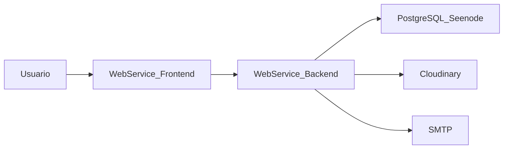

# Despliegue en Seenode — Herastats

Guía paso a paso para publicar **frontend React**, **backend Express** y **PostgreSQL** en [Seenode](https://cloud.seenode.com).

Relacionado: [SECURITY_DEPLOY.md](SECURITY_DEPLOY.md)

## Arquitectura



| Componente | Directorio | Puerto Seenode | Comando start |
|------------|------------|----------------|---------------|
| Backend API | `backend/` | `5000` | `npm run start` |
| Frontend SPA | `frontend/` | `8080` | `npm run start:prod` |
| PostgreSQL | (gestionado) | — | — |

---

## Fase 0 — Preparación local

### 1. Secretos y dominios

Genera un `JWT_SECRET` seguro:

```bash
node scripts/generate-secrets.js
```

Plantillas de variables (copiar a Seenode, **no commitear**):

- Backend: [backend/.env.seenode.example](../backend/.env.seenode.example)
- Frontend: [frontend/.env.seenode.example](../frontend/.env.seenode.example)

Anota las URLs que usarás:

| Variable | Ejemplo |
|----------|---------|
| URL backend | `https://herastats-api-xxxx.seenode.com` |
| URL frontend | `https://herastats-app-xxxx.seenode.com` |
| `REACT_APP_API_URL` | `https://herastats-api-xxxx.seenode.com/api` |
| `CORS_ORIGIN` | `https://herastats-app-xxxx.seenode.com` |
| `FRONTEND_BASE_URL` | `https://herastats-app-xxxx.seenode.com` |

### 2. Checklist de seguridad

- [ ] Rama estable pusheada a GitHub/GitLab conectado a Seenode
- [ ] Sin `.env` ni secretos en el historial Git (`npm run security:check` en `backend/`)
- [ ] `HERASTATS_SEED_DEFAULT_SUPERUSER=false` en producción
- [ ] Cloudinary y Google Maps con claves de producción (restringidas)

---

## Fase 1 — PostgreSQL en Seenode

1. Entra en [cloud.seenode.com](https://cloud.seenode.com) → **Databases** → **Create first database**.
2. Tipo: **PostgreSQL**. Nombre sugerido: `herastats-prod`.
3. Elige tier (Tier 1/2 para arranque; escala después según uso).
4. Espera a que el estado sea **Ready**.
5. Guarda los parámetros de conexión que muestra el panel (host, puerto, usuario, contraseña, nombre de BD).

> El backend crea las tablas automáticamente al arrancar (`createTable()` en `backend/src/server.js`). No hace falta ejecutar migraciones manuales.

---

## Fase 2 — Backend (Web Service)

### Crear servicio

1. **Create Web Service** → conecta el repositorio de Herastats.
2. Configuración:

| Campo | Valor |
|-------|-------|
| Root directory | `backend` |
| Build command | `npm install` |
| Start command | `npm run start` |
| **Port** | `5000` |

### Vincular base de datos

1. En el servicio backend → pestaña **Environment**.
2. Sección **Database Connections** → vincula `herastats-prod`.
3. Seenode inyecta `DATABASE_URL` automáticamente. El código la soporta en [`backend/src/config/dbConfig.js`](../backend/src/config/dbConfig.js).

Si **no** usas el enlace automático, define manualmente `DB_HOST`, `DB_PORT`, `DB_NAME`, `DB_USER`, `DB_PASSWORD`.

### Variables de entorno (backend)

| Variable | Valor |
|----------|-------|
| `NODE_ENV` | `production` |
| `CORS_ORIGIN` | URL del frontend (sin `/` final) |
| `JWT_SECRET` | Generado con `generate-secrets.js` |
| `HERASTATS_SEED_DEFAULT_SUPERUSER` | `false` |
| `MIN_PASSWORD_LENGTH` | `10` |
| `FRONTEND_BASE_URL` | URL del frontend |
| `SITE_URL` | Mismo dominio público que `REACT_APP_SITE_URL` (sitemap en `/sitemap.xml`) |
| `ANALYTICS_IP_SALT` | Secreto para hash de visitantes (analytics interno) |
| `ANALYTICS_RETENTION_DAYS` | `90` (opcional) |
| `GEOIP_DB_PATH` | Ruta al `.mmdb` GeoLite2-Country (opcional; Cloudflare `CF-IPCountry` tiene prioridad) |
| `CLOUDINARY_*` | Credenciales Cloudinary |
| `SMTP_*` | Credenciales correo |

### Primer deploy backend

1. **Deploy** y revisa logs hasta ver:
   - `Conexión a PostgreSQL exitosa`
   - `Tabla de usuarios inicializada` (y resto de tablas)
   - `Servidor corriendo en puerto 5000`
2. Verifica healthcheck:

```bash
curl https://TU-BACKEND.seenode.com/api/health
```

Respuesta esperada:

```json
{ "message": "Servidor funcionando correctamente", "database": "ok" }
```

3. Script automatizado:

```bash
cd backend
npm run deploy:verify -- https://TU-BACKEND.seenode.com
```

### Crear primer usuario admin

En producción el registro público está **bloqueado**. Opciones:

1. **Invitación por correo** (requiere SMTP configurado) desde un superusuario existente.
2. **Seed puntual** (solo primera vez): activar temporalmente en Seenode:
   - `HERASTATS_SEED_DEFAULT_SUPERUSER=true`
   - `TEST_DEFAULT_SUPERUSER_EMAIL=admin@tudominio.com`
   - `TEST_DEFAULT_SUPERUSER_PASSWORD=contraseña_segura_min_10`
   - Redeploy → login → **volver a** `HERASTATS_SEED_DEFAULT_SUPERUSER=false` y redeploy.

---

## Fase 3 — Frontend (Web Service)

> Despliega el frontend **después** de que el backend responda `database: ok`.

### Crear servicio

1. **Create Web Service** (segundo servicio, mismo repo).
2. Configuración:

| Campo | Valor |
|-------|-------|
| Root directory | `frontend` |
| Build command | `npm install && npm run build` |
| Start command | `npm run start:prod` |
| **Port** | `8080` |

### Variables de entorno (frontend)

Definir **antes** del build (Seenode las usa en build command):

| Variable | Valor |
|----------|-------|
| `REACT_APP_API_URL` | `https://TU-BACKEND.seenode.com/api` |
| `REACT_APP_SITE_URL` | `https://tudominio.com` (dominio público del SPA, sin `/` final) |
| `REACT_APP_GA4_MEASUREMENT_ID` | `G-XXXXXXXXXX` (opcional; GA4 tras consentimiento) |
| `REACT_APP_GOOGLE_MAPS_API_KEY` | (opcional, con restricción por referrer) |

El build falla si falta `REACT_APP_API_URL` (validado por `frontend/scripts/validate-production-env.js`).

### Validación frontend

1. Abre la URL pública del frontend.
2. Inicia sesión con el usuario admin creado.
3. En DevTools → Network, confirma que las peticiones van a `https://TU-BACKEND.seenode.com/api`.
4. No debe haber errores CORS (revisa que `CORS_ORIGIN` en backend coincida exactamente con la URL del frontend).

### SEO y Search Console

1. Configura `REACT_APP_SITE_URL` y `SITE_URL` con tu dominio propio.
2. En [Google Search Console](https://search.google.com/search-console), verifica el dominio (meta tag en `frontend/public/index.html` o DNS TXT).
3. Envía el sitemap: `https://tudominio.com/sitemap.xml` (generado por el backend; si API y SPA están en hosts distintos, proxy `/sitemap.xml` al backend o usa la URL del API).
4. Actualiza `Sitemap:` en `frontend/public/robots.txt` con tu dominio.
5. Panel de visitas interno: `/analytics` (solo superuser). GA4 opcional con `REACT_APP_GA4_MEASUREMENT_ID`.

---

## Fase 4 — Checklist funcional post-deploy

| # | Prueba | Cómo verificar |
|---|--------|----------------|
| 1 | Health API | `GET /api/health` → `database: ok` |
| 2 | Login | Iniciar sesión en el frontend |
| 3 | Torneos | Crear / listar / editar un torneo |
| 4 | Cloudinary | Subir imagen en configuración de torneo |
| 5 | Correo | Flujo set-password o invitación (requiere SMTP) |
| 6 | Registro bloqueado | `POST /api/auth/register` → 403 en producción |

Script básico:

```bash
node scripts/verify-deploy.js https://TU-BACKEND.seenode.com
```

---

## Fase 5 — Operación, monitoreo y rollback

### Monitoreo recomendado

En el panel de Seenode revisa periódicamente:

- **Backend**: CPU, memoria, errores 5xx en logs, latencia de `/api/health`.
- **PostgreSQL**: uso de almacenamiento; escalar tier antes de llenar el disco.
- **Frontend**: builds exitosos tras cada push.

Comprobación externa opcional (cron/UptimeRobot):

```bash
curl -sf https://TU-BACKEND.seenode.com/api/health | grep '"database":"ok"'
```

### Backups

1. En Seenode → base de datos → revisa opciones de backup/snapshot según tu plan.
2. Antes de cambios destructivos (reset torneo masivo, migraciones manuales), exporta un dump:

```bash
pg_dump "$DATABASE_URL" -Fc -f herastats-backup-$(date +%Y%m%d).dump
```

(Usa la cadena de conexión del panel de Seenode en una máquina con `pg_dump` instalado.)

### Rollback

| Fallo | Acción |
|-------|--------|
| Backend (código/env) | Seenode → servicio backend → redeploy release anterior o revertir variables |
| Frontend (build) | Redeploy del commit anterior; verificar `REACT_APP_API_URL` |
| Base de datos | Restaurar snapshot/dump; reiniciar backend; validar `/api/health` |
| JWT comprometido | Rotar `JWT_SECRET` en Seenode → redeploy (invalida todas las sesiones) |
| Cloudinary filtrado | Rotar API secret en Cloudinary y actualizar env en Seenode |

### Rotación de secretos

Ver procedimiento completo en [SECURITY_DEPLOY.md](SECURITY_DEPLOY.md#respuesta-ante-filtración-de-credenciales).

---

## Solución de problemas

| Síntoma | Causa probable | Solución |
|---------|----------------|----------|
| `database: error` en health | BD no vinculada o credenciales incorrectas | Revisar Database Connections y `DATABASE_URL` |
| Error SSL PostgreSQL | SSL requerido por Seenode | Dejar `DB_SSL` sin definir (SSL auto en prod) o `DB_SSL=require` |
| CORS en navegador | `CORS_ORIGIN` no coincide | Usar URL exacta del frontend (https, sin barra final) |
| Build frontend falla | Falta `REACT_APP_API_URL` | Añadir variable antes del build |
| Puerto no responde | Port field ≠ puerto de la app | Backend `5000`, frontend `8080` |
| Login 401 tras deploy | JWT distinto entre entornos | Normal; volver a iniciar sesión |
| Imágenes no suben | Cloudinary mal configurado | Revisar `CLOUDINARY_*` en backend |

---

## Orden de ejecución (resumen)

1. Generar secretos (`node scripts/generate-secrets.js`)
2. Crear PostgreSQL en Seenode
3. Desplegar backend → validar `/api/health`
4. Crear usuario admin (seed puntual o invitación)
5. Desplegar frontend con `REACT_APP_API_URL` del backend activo
6. Ejecutar checklist funcional
7. Configurar monitoreo y política de backups
